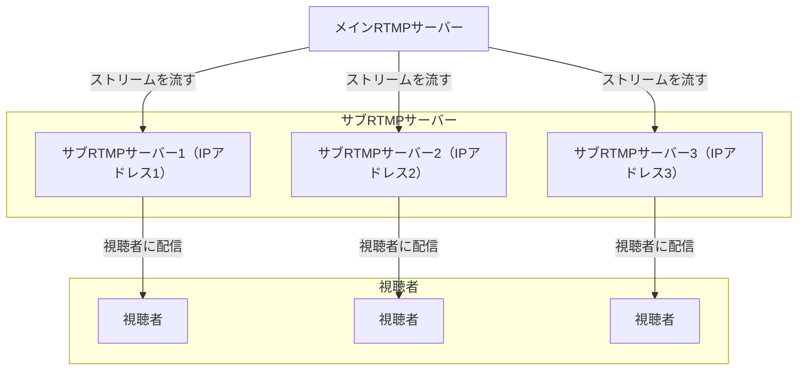

# Nginx-HLS-Server-Config
Nginxを使ってHLSとRTMPサーバーを建てるマニュアル

# 構成



# インストール
Nginxをソースからビルドする必要があります。

### 必要Module
- [ ] ngx_http_realip_module
- [ ] nginx-rtmp-module

# サーバーの追加方法
任意のサーバーにNginxをインストールし、child_server.confを追加してください。

`server_name`の部分には、そのサーバーのIPを入力してください。

```
server {
		listen 80;
		# これを起動しているサーバーのIP	
		server_name xxx.xxx.xxx.xxx;
}
```

# サブサーバーで生成されたm3u8にアクセスするには？
`create_symlink_nginx.sh`　を適当なディレクトリに配置してください。

そのスクリプトはm3u8のSymbolic linkを生成し、クライアントがアクセスした際にアクセス可能となります。


# 注意事項
### CloudflareのIPレンジについて


https://www.cloudflare.com/ja-jp/ips/


これは常に変わる可能性があるため、スクリプトで自動更新をするか手動でアップデートを行う必要があります

```
http {
	# メインサーバー用のNginxコンフィグに設定してください
	set_real_ip_from 173.245.48.0/20;
}
```


